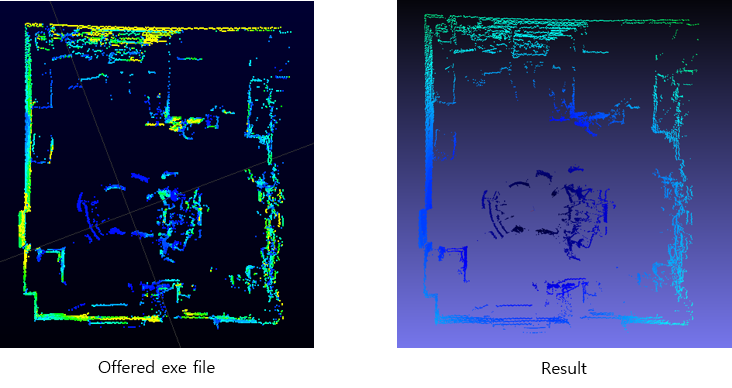

# Velodyne 3D-Lidar Visualization Program

     
	<b>The result video</b> 

  
  
## Introduction  
  
  
>For the graduation thesis, I needed to use 3D-Lidar in 2016 Feb. I used velodyne VLP-16 and they offered a `exe file` for checking 3D information. But I had to control each values, I coded visualization program.  

## Summary  
  
  
* I used OpenCV's **viz class** for visualizing 3D points. 
* You can also make visualization program with [**`ROS`**](http://wiki.ros.org/velodyne) and [**`PCL`**](http://pointclouds.org/documentation/tutorials/hdl_grabber.php).
* I used Velodyne in 2017 Feb again with PCL. It's better than mine. (more stable)
* I used thread library for real-time 360 degree visualization.

## Installation & Environment  
  
  
### Environment  
  
#### software  
  
>Windows 8.1(x64), Visual studio 2013, OpenCV 3.0    
You need to isntall **VIZ** from OpenCV.
 
#### hardware  
  
>CPU : i3-4005U 1.72GHz, Memory : 6GB
Velodyne VLP-16 model

## Receiving data

I recived data from velodyne with UDP. I analyzed each packet using wireshark.  

## Convert data to XYZ points

I converted each datas to XYZ points using VLP-16 datasheet.

## Result

     

As you can see, my visualization program also shows well. The different color doesn't mean much. In my code, each color means distance.